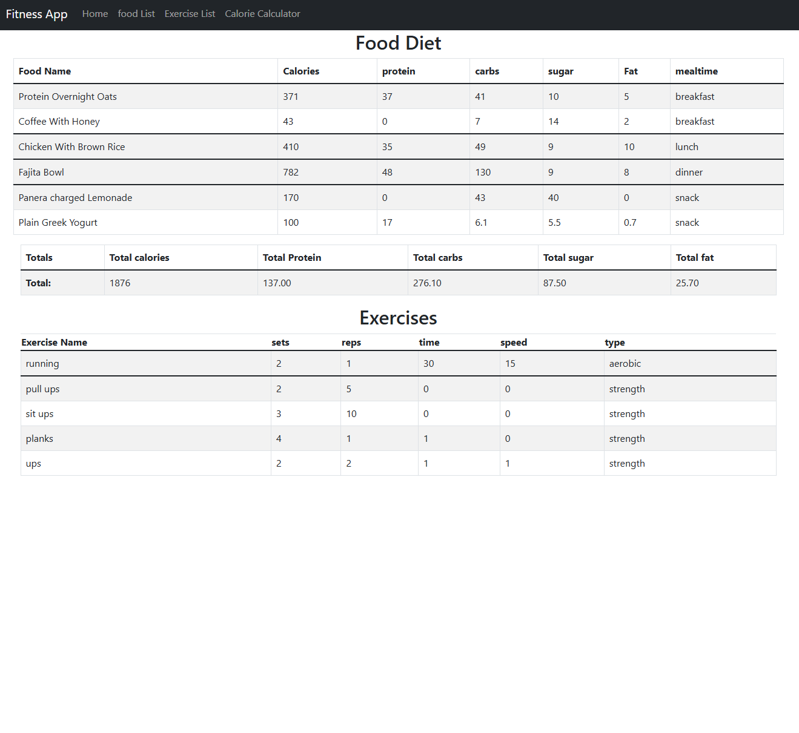

# FitThrive

## Description
FitThrive is an application that allows users to track both their fitness and food diets.
It uses java spring for backend and react with JavaScript for the frontend. 
Well suited for people who want a sleek and simple way of tracking their diets and exercise information.

## Motivation
The motivation from this project birthed from the effects of the covid pandemic, where many were not keeping track of their lifestyle and letting their food diets and fitness lapse, including me. 
To combat the atrophy, I created an application that was simple to use and easy for users to follow vs all the complicated apps that exist for this goal. 
The application would allow you to put your diet and exercises and put the macro nutrients so that you have an easy view of what to follow throughout the day. 
In the end the goal for this application was to make it so easy to follow that you wouldn't think about it and adjust easily to your situation.

## Quick Start
This project uses jdk 8:
- In terminal in selected folder run ```Git clone https://github.com/Jruz9/lifestyle-fitness-webapp.git```
- Run command in java project folder to make jar(compiles app). ```mvn clean install```
- Click on your jar file and the application will run.
  - _Note that the app will run and no data will appear since no database is connected._
## Usage
- Create,update, and delete food list.
- Create, update, and delete exercise list.
- Summarize food macros.
- summarize exercise macros.

## Contribution

### Requirement for your computer
- Backend
  - Java 8.0
  - spring boot 2.7.1
- Frontend
  - NPM
  - React 18.1
  - Mysql
### Getting Correct java version java
-  Download Java development kit from Adoptium here ```https://adoptium.net/marketplace/?version=8&os=any```
### Setting up Local Mysql Database
- Open mysql workbench gui console.
- Create a database with root as username and password as password for local not production.
-  Run the schema sql file to create the local database.
### Build React frontend
- Inside the frontend folder/frontend/src folder run in terminal to install dependencies : ```npm install```
- To run the web application in the same folder Run ```npm start```
### Build java backend
- IDE with java developer tools will recognize the pom xml if your in the java backend folder tree and auto build for it. If that does not happen continue forward 👇
- Open the main folder main/java/com.webapp.lifestylefitnesswebapp in the project and run build package option in the pom xml file for IntelliJ and similar or ```maven clean``` in the command line